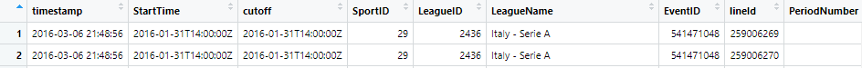
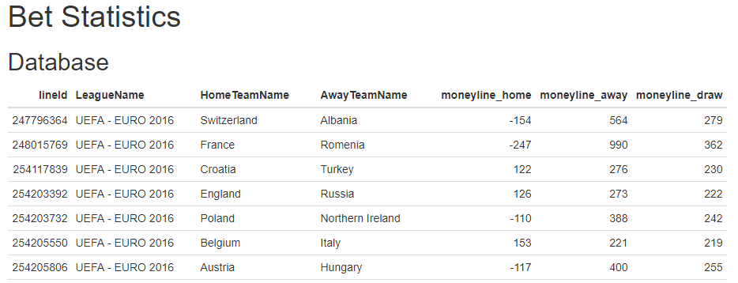

# **R Trading Bot for Sports Betting** :moneybag::dollar:

RBot is a ready to go trading bot structure written in R for sports betting markets. It utilizes the API from  (https://github.com/pinnacleapi)
and rewrites parts of the code to optimize for better performance.
The main functions are:
* Runs on client systems as well as on servers and is built for maximum stability and robustness as far as possible within the R framework which is not meant for production:computer::rofl:
* All possible errors and warnings are caught and handled so the bot can accomplish a maximum sytem uptime on servers. Usually R's bad memory management leads to breaks or hanging after some days
* Employs an infinite loop and regularly reads tick data (every x minutes) from selected types of sports and writes the result to an in-memory database (SQLite) and/or to files on disk. The tick data frame structure includes all possible attributes:

* The included rbotstats.Rmd markdown file is meant as a starting point for further analyses

* You can customize the code so you can run your own strategies and statistics within the main loop
